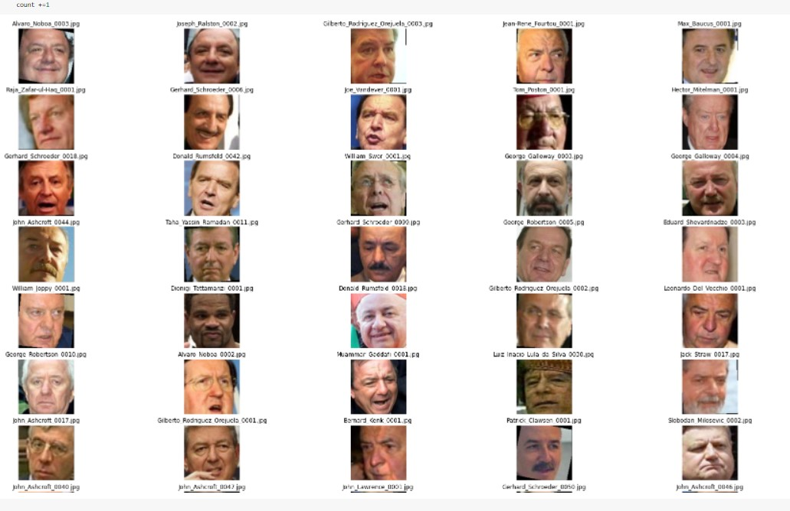

# Report

## Abstract

In this project, we implemented a reverse image search engine, which applies DeepFace. During the experiment, we verified our model on the LFW database.

## Introduction

Reverse visual search helps us find artifacts that are similar to a query artifact. For example, if we have a picture of a flower and want to know what kind of flowers it is, such a reverse image search engine will be useful. Besides the function of getting information about an image, reverse visual search can also be used to locate the original source of an image, find higher resolution versions, know the approximate date when the picture was first published on the Internet, and so on.

In fact, reverse image search is a kind of infromation retrieval, which uses an image in place of a text-based query. The difference between an image and a text is the way we encode an image. It's also similar to image retrieval where we search images based on text or context input. The techinical challenge of reverse image search lies in that how we score the similarity between different images. Given two sample pictures, we can easily determine if ther are similar visually. However, it's not easy to extract their features.

In this project, we implemented a reverse image search engine based on the LFW database. Given a picture of face, we first embedded it into the model and predicted. Then we made up the query and searched it in the database. Our model returns the similarity score and related images based on the input data. We can see the result included not only the original face picture that we searched, but also other similar pictures of the same person.

## Related Work

### Image Retrieval

An image retrieval system is a computer system used for browsing, searching and retrieving images from a large database of digital images. In the task of image retrieval, there're different algorithms, for example, product quantization, SIFT, vector of locally aggragate descriptor (VLAD), KNN, etc. It has several search methods, including image meta search, content-based image retrieval (CBIR) and image collection exploration.

### Face Recognition

There're a lot of works in the field of face recognition. In fact, face recognition doesn't only include identification, it's also related to face detection, alignment, representation, classification and verification. Face alignment is to correct the pose of detected faces, and face verification is to answer whether the detected face matches the given picture.

Face recognition can be classified into two categories. One is based on simple features, and the other is based on deep learning. The previous methods first extract local features of face images, like SIFT, LBP, HOG, and then aggragate them into global face descriptors through pooling. The latter methods always depend on a CNN. For example, DeepFace uses a deep CNN fed by 3D models to do the alignment and applies a DNN to extract the features of face images. DeepFace also leverages Siamese network to verify the correctness. There're also a lot of other face recognition models, such as VGG-Face, Google FaceNet, OpenFace, DeepID, Dlib, ArcFace, etc.

### Applications

Nowadays, we have had a lot of applications in reverse image search. Google's Search by Image is one of the most popular system. It uses the technique of reverse search and allows users to serach for related images just by uploading an image or image URL. TinEye is also a search engine specialized for reverse image search. It creates a unique and compact digital signature or fingerprint of said image and matches it with other indexed iamges. There're also other systems like eBay, Pinterest, Bing, Alibaba and so on.

## Data

We use the LFW (Labeled Faces in the Wild) as our dataset. It's an image database which collects face images for verification.

## Methods

### Design

In the baseline model, we leverage the `VGG-16` CNN to do the image embedding and `KNN` to finish the search part.

We leverage `DeepFace` and `Elasticsearch` in our model.

`DeepFace` is a facial recognition library for Python. It wraps many cutting-edge face recognition models passed the human-level accuracy, including ArcFace, Boosting, DeepID, DlibResNet, DlibWrapper, Facenet, Facenet512, FbDeepFace, OpenFace, and VGGFace. We can get access to a set of features like face verification, face recognition, facial attribute anaylsis and real-time face analysis using the API of DeepFace. In our implemention, we use the `Facenet` from DeepFace base models.

`Elasticsearch` is a distributed search engine based on the Lucene library. It's implemented with an HTTP web interface and schema-free JSON documents. So we generate our query through key-value format and pass the query to `elasticsearch` to search the similar face images.

### Implemention

We install `Elasticsearch` and `Kibana`. `Elasticsearch` is getting on port 9200.

Install `elasticsearch` package with `!pip install elasticsearch`.

Create an index and its name is `face_recognition`. Then use index to store face representation vector and its file name. 

Build FaceNet model by using DeepFace framework. The dimension of the dense vector is set to 128, and it is also the output size of the FaceNet model.

Read the image names and paths in our `lfw` file. To find the vector representation, we feed the facial image to our FaceNet model, and then store face embedding and path in our index.

We search a target image the picture named `Alvaro_Noboa_0001.jpg` under `Alvaro_Noboa` directory and find its vector representation.

Then, we create a query to search in the Elasticsearch index, and pass the query to the Elasticsearch index that we created before. Finally, we plot the result as following.

## Experiments

In the experiment part, we 

## Conclusion

In this project, we finish reverse image search using the model of `DeepFace` and `Elasticsearch`. We imporve the baseline model by applying a more effective face embedding model and search engine. The experiment is conducted on the LFW database, and the result score is higher than the baseline.

